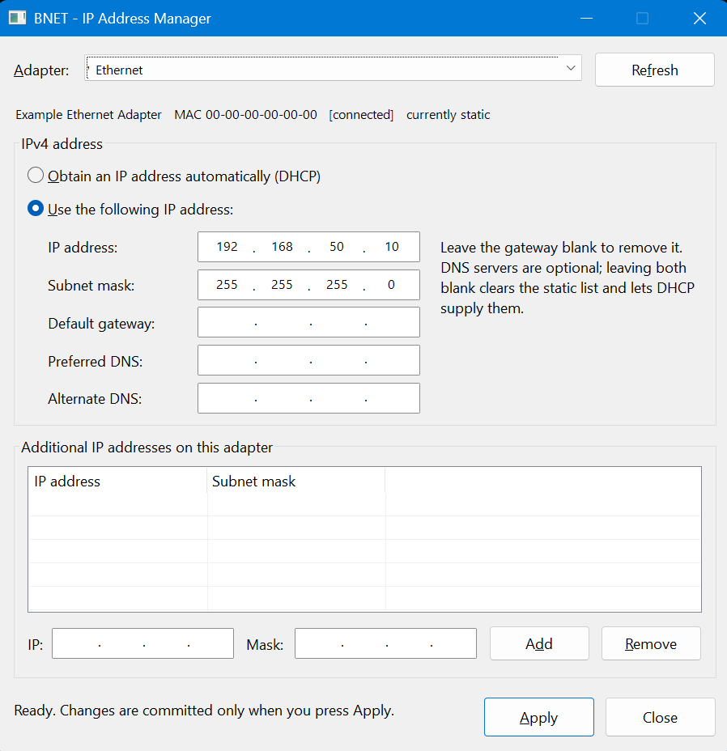

# BNET — IP Address Manager

One dialog that does what the Windows IPv4 property sheets do.

Setting a static address on Windows 10/11 means Settings → Network → Change adapter
options → adapter → Properties → Internet Protocol Version 4 → Properties → Advanced →
Add, and the *additional* addresses are two dialogs deeper than the first one. BNET puts
the whole thing on a single surface: adapter, DHCP-or-static, address, mask, gateway, DNS
and the full list of additional addresses, committed together by one **Apply**.



## What it does

- **Picks an adapter** from a drop-down, showing its description, MAC, link state and
  whether it is currently on DHCP or static.
- **Switches between DHCP and static**, the same choice as the radio pair in the Windows
  dialog.
- **Sets IP address, subnet mask, default gateway** and the **preferred/alternate DNS**
  servers.
- **Adds and removes additional IP/mask pairs** on the same adapter — the part that
  normally lives behind the *Advanced* button.
- **Re-reads the system after every Apply**, so what you see afterwards is what Windows
  actually has, not what was asked for.

Nothing is committed until Apply. Add and Remove only change the pending list.

## How it reads and writes

Reading is the IP Helper API (`GetAdaptersAddresses`) — fast, no COM, no elevation needed.

Writing is WMI's `Win32_NetworkAdapterConfiguration`, because `EnableStatic(ips[], masks[])`
takes **arrays** — which is exactly the additional-addresses case, applied in one call —
and because it persists the same way the control panel does. `SetGateways` and
`SetDNSServerSearchOrder` follow it. The adapter is located by its `SettingID` (the GUID),
**not** by `Index`: WMI's `Index` is not the `IfIndex` the IP Helper API reports, and
assuming they match configures the wrong adapter.

Applying runs on a worker thread and posts its result back, because WMI takes seconds on a
busy adapter and a frozen dialog looks like a crash.

## Behaviour worth knowing

- **It requires administrator** and its manifest asks for it up front, rather than failing
  at Apply with WMI error 91.
- **Under DHCP the fields still show the current values.** They are what the server handed
  out, which is the sane starting point for going static — Windows blanks them instead.
- **169.254.x.x autoconfiguration addresses are hidden.** They are not something you set,
  and offering one back as a static address would be a trap.
- **A gateway off-subnet raises the same warning Windows gives**, for the same reason: it
  is unreachable and silently does nothing. You can override it.
- **Masks are checked for contiguity** — a run of ones then a run of zeroes. `255.255.0.255`
  is refused here rather than by WMI.
- **Double-click a row** in the additional list to lift it back into the entry fields for
  editing; press Add to put it back. That is the closest thing to editing in place without
  opening a second dialog.
- **A blank gateway clears the gateway.** Blank DNS fields clear the static DNS list, which
  hands DNS back to DHCP.
- IPv6 is not touched. This is an IPv4 tool.

## Building

```
cmake -S . -B build -G "Visual Studio 18 2026" -A x64
cmake --build build --config Release
```

Plain Win32, C++20, no external dependencies. Builds `/W4 /WX` clean. The release exe links
the static CRT, so it needs no VC++ redistributable:

```
dumpbin /dependents build\Release\BNET.exe
```

shows only `IPHLPAPI`, `WS2_32`, `COMCTL32`, `ole32`, `OLEAUT32`, `KERNEL32` and `USER32`.

## Layout

```
src/NetConfig.h    adapter/apply model, no UI
src/NetConfig.cpp  IP Helper enumeration + the WMI apply
src/main.cpp       the dialog
res/BNET.rc        dialog template, version info, manifest reference
res/BNET.manifest  requireAdministrator, common controls v6, per-monitor DPI
```
